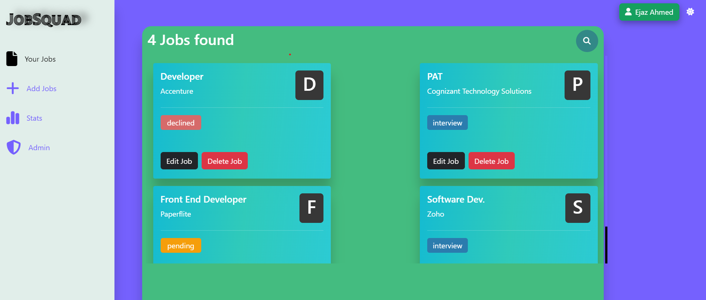

# JobTrack - MERN Application

JobTrack is a web application for tracking and managing job applications. This MERN (MongoDB, Express.js, React, Node.js) project allows users to keep track of job openings, application deadlines, and interview details.




## Table of Contents
- [Features](#features)
- [Technologies Used](#technologies-used)
- [Uses](#uses)
- [Installation](#installation)

## Features
- User registration and authentication.
- Add, update, and delete job applications.
- Track application status, deadlines, and interview details.
- Dashboard with data visualization for application statistics.
- Responsive design for mobile and desktop.

## Technologies Used
- MongoDB: Database for storing job application data.
- Express.js: Server framework for building the backend API.
- React: Frontend library for creating the user interface.
- Node.js: Runtime environment for the server.
- Axios: Provides a simple and consistent API to interact with RESTful APIs, perform asynchronous operations, and handle responses.

## Uses
- **Job Listing:** Keep track of job listings from various sources.
- **Application Management:** Record application deadlines, status, and submission details.
- **Resume Organizer:** Store and manage different versions of your resume.
- **Interview Scheduler:** Schedule and manage interviews and follow-ups.
- **Data Insights:** Visualize your job search progress with charts and statistics.
- **Deadline Reminders:** Set reminders to stay on top of application deadlines.
- **Secure and Private:** Protect your job search data with user authentication.

### Installation
1. Clone the repository:
   ```bash
   git clone https://github.com/yourusername/JobTrack.git

